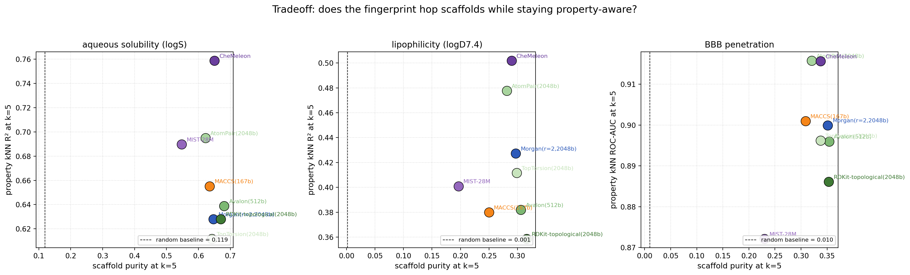
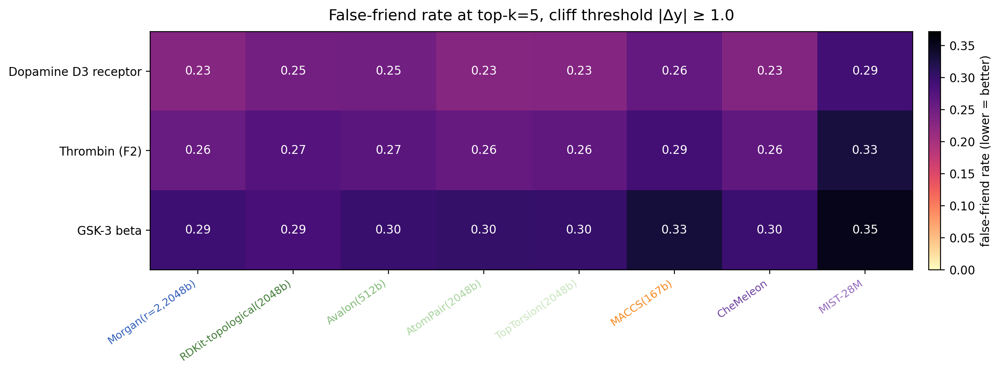

# Comparing classical and neural molecular fingerprints

Eight fingerprints (six classical RDKit + two neural) probed across six lenses. The point is not to crown a winner — it's to show how different the fingerprints actually are, and where each one's blind spots hide.

## Fingerprints studied

- **Local atom-environment**: Morgan (r=2, 2048 bits)
- **Path-based**: RDKit topological, Avalon, AtomPair, TopTorsion
- **Expert keys**: MACCS (167 bits)
- **Neural**: CheMeleon, MIST-28M

## Investigations

| # | Lens | Question |
|---|------|----------|
| 1 | Pair plots | What does each FP think of hand-picked molecule pairs? |
| 2 | ADME alignment | Does FP geometry track ADME properties? |
| 3 | Agreement matrix | How redundant are the FPs across each other? |
| 4 | Scaffold hopping | Does the FP preserve scaffold structure, and is that bought at the cost of property awareness? |
| 5 | Activity cliffs | How often does each FP host activity cliffs in its top-k neighborhoods? |

There's also a clustering experiment under `figures/clustering/` (HDBSCAN over UMAP-reduced fingerprints on a 10k-molecule random ChEMBL sample). The result was that random ChEMBL is too scaffold-diverse to cluster meaningfully — useful as a sanity check that "fingerprint geometry → clusters" is not a free lunch, but not the central story.

## Conclusions

### Fingerprints encode genuinely different similarity geometries


The RV agreement matrix is the clearest evidence. Classical FPs are not redundant with each other — most pairs sit at RV 0.30–0.40. RDKit-topo and Avalon agree most (0.62, both path-based). MIST-28M is alone in its corner (RV ~0.15–0.30 with most others). CheMeleon bridges classical and MIST. AtomPair turns out to be the "connector" — high RV with both CheMeleon (0.66) and MIST (0.65) while still being related to the classical block.

### The two neural FPs are very different from each other

Lumping them together is misleading. The scaffold-vs-property Pareto and the cliff false-friend summary tell the same story:





- **CheMeleon behaves like a high-resolution classical FP**. It dominates the scaffold–property Pareto on AqSolDB — both highest scaffold purity AND highest kNN R². It's competitive with the best classicals on activity cliffs. The "neural FPs abandon chemistry" critique does not apply.
- **MIST-28M behaves like an abstract embedding**. It's the least scaffold-anchored, the most distinct in the RV matrix, and consistently the worst at avoiding false friends in its neighborhoods. It's measuring something different — possibly useful when paired with a strong supervised model that exploits its non-classical geometry, but a poor pick for direct similarity-based retrieval.

### Classical FPs are also not interchangeable

The pair plots already hinted at this — even on four hand-picked pairs the classical FPs disagree visibly:


- **Morgan** is the most idiosyncratic — its highest off-diagonal in the RV matrix is only 0.57 (with TopTorsion). Atom-environment hashing preserves both scaffold and decoration in a way path-based FPs don't.
- **Avalon** is the dark horse. 512 bits, performs at the level of the 2048-bit FPs across nearly everything (best scaffold purity on AqSolDB, ties best on cliff false-friend rate on Thrombin/GSK-3β).
- **MACCS** is short (167 bits) and fast, with a measurable accuracy cost: 2–4 percentage points worse on cliff false-friend rate, slightly higher cliff RMSE penalty. The size/speed tradeoff is real but not crippling.
- **RDKit-topo, AtomPair, TopTorsion** look similar on paper. They aren't (RV 0.28–0.62 with each other). If ensembling with Morgan, **AtomPair** gives the most distinct second view.

## Gotchas

**General:**

- **Don't bake one FP into how you define your test.** Defining cliffs as "Morgan ≥ 0.9 with large Δy" reduces every other FP comparison to "agreement with Morgan." The false-friend rate is fingerprint-symmetric — each FP is judged on its own neighborhood.
- **Local geometry ≠ global geometry.** All FPs show useful local kNN signal but only modest global Spearman ρ — see the right panel below, ρ ≤ 0.25 everywhere on logS:

  

  Methods that rely on global geometry (UMAP-then-cluster, Spearman over all pairs) amplify whatever idiosyncrasy each FP has.
- **Scaffold-purity needs scaffold-repeat-rich data.** Random ChEMBL is so scaffold-diverse (4490 unique scaffolds per 5000 molecules) that purity-at-k is mostly noise. AqSolDB has dense repeats and is the right venue.
- **Cliff RMSE is dataset-dependent.** On D3 receptor every FP showed *negative* cliff penalty (cliff regions are densely sampled). On Thrombin and GSK-3β the expected positive penalty appeared. Don't draw conclusions from one cliff dataset.

**Per-fingerprint:**

- **MACCS** has only 167 bits — distinct molecules collide more often.
- **MIST cosine scores are NOT on the same scale as Tanimoto.** Cosine 0.4 between two MIST embeddings does not mean what 0.4 Tanimoto means. Threshold-based intuition built on Morgan does not transfer. Use rank-based comparisons or per-FP-calibrated thresholds.
- **CheMeleon similarity is "chemistry-aware" but not biology-aware.** High CheMeleon similarity doesn't mean two molecules will share activity — they remain subject to activity cliffs at roughly the same rate as classical FPs.
- **Morgan's "two molecules share a key motif" failure mode** is real: two compounds can both light up the same Morgan bit while differing globally. The drug-sized pair heatmap shows this — 0.75 Tanimoto between aniline-quinazoline and gefitinib, driven entirely by their shared core:

  

## Practical takeaway

Pick the fingerprint for the question:

- **Activity-aware retrieval / kNN regression** on a known target → Morgan, AtomPair, or CheMeleon.
- **Chemotype discovery / clustering** in a drug-like library → if natural clusters exist at all, MACCS and Avalon are most likely to surface them; MIST is the least scaffold-anchored and least likely to.
- **Feature input to a supervised neural model** → MIST's distinctness from classical FPs may be the point.
- **One general-purpose FP** → CheMeleon is the strongest single choice we tested.
- **Ensembling** → pair Morgan with AtomPair (or with a neural FP) for maximally distinct views.

## Reproducing

```bash
uv sync
uv run python scripts/figure_pairs.py
uv run python scripts/figure_clustering.py
uv run python scripts/figure_adme.py
uv run python scripts/figure_adme_alignment.py --mode sweep
uv run python scripts/figure_adme_alignment.py --mode bars --k 5
uv run python scripts/figure_agreement.py
uv run python scripts/figure_scaffolds.py
uv run python scripts/figure_cliffs.py
```

Figures land under `figures/<topic>/`.
