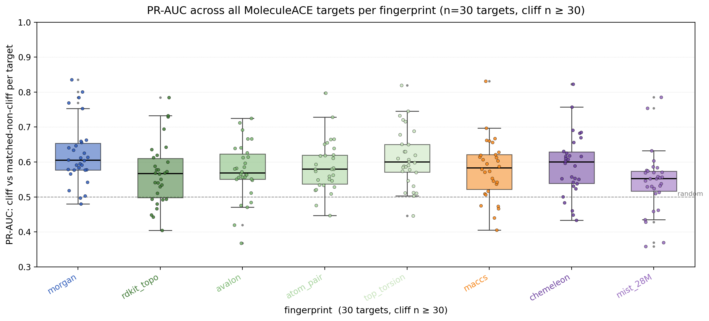
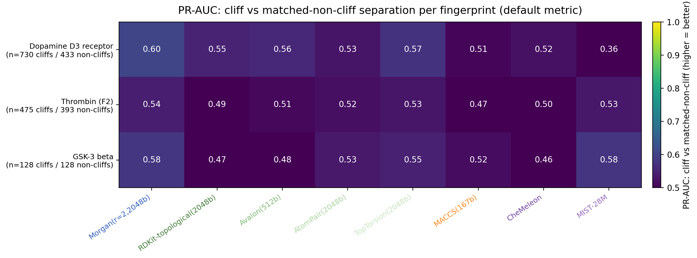
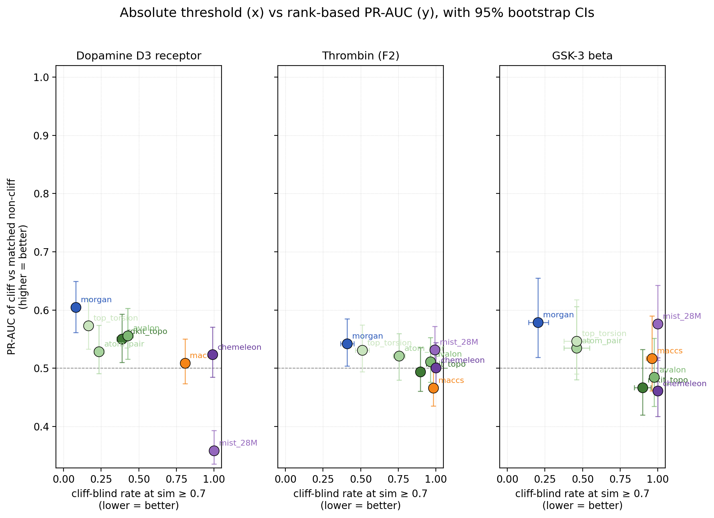
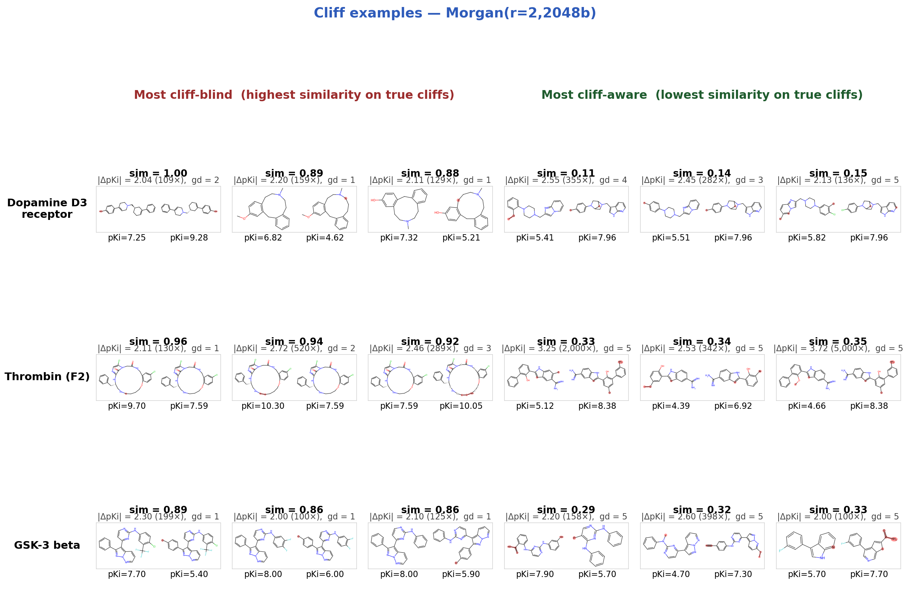
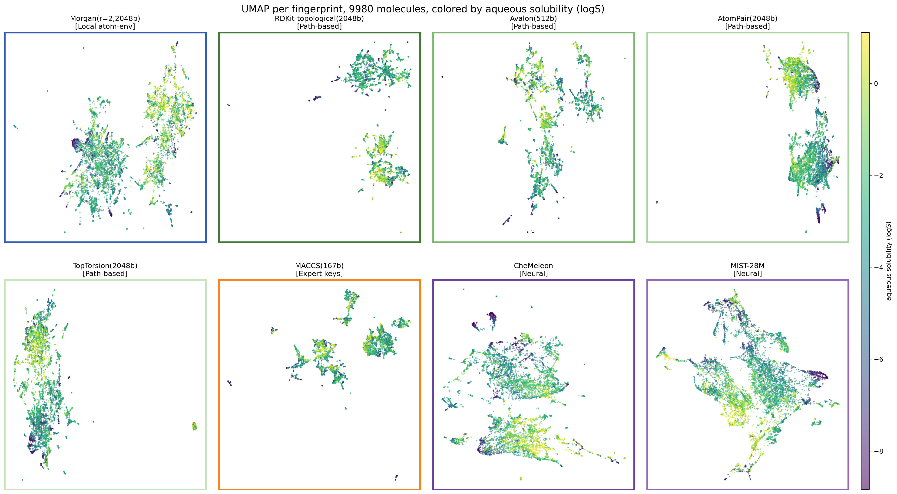

# Comparing classical and neural molecular fingerprints

Disclaimer - a lot of LLM help here.

Eight fingerprints (six classical RDKit + two neural) probed across six lenses. The point is not to crown a winner — it's to show how different the fingerprints actually are, and where each one's blind spots hide.

## Fingerprints studied

- **Local atom-environment**: Morgan (r=2, 2048 bits)
- **Path-based**: RDKit topological, Avalon, AtomPair, TopTorsion
- **Expert keys**: MACCS (167 bits)
- **Neural**: CheMeleon, MIST-28M

## Investigations

| # | Lens | Question |
|---|------|----------|
| 1 | Pair plots | What does each FP think of hand-picked molecule pairs? |
| 2 | ADME alignment | Does FP geometry track ADME properties? |
| 3 | Agreement matrix | How redundant are the FPs across each other? |
| 4 | Scaffold hopping | Does the FP preserve scaffold structure, and is that bought at the cost of property awareness? |
| 5 | Activity cliffs | For pre-defined activity cliffs (small chemical change, large potency change), what similarity score does each FP assign? |

There's also a clustering experiment under `figures/clustering/` (HDBSCAN over UMAP-reduced fingerprints on a 10k-molecule random ChEMBL sample). The result was that random ChEMBL is too scaffold-diverse to cluster meaningfully — useful as a sanity check that "fingerprint geometry → clusters" is not a free lunch, but not the central story.

## Conclusions

### Fingerprints encode genuinely different similarity geometries


The RV agreement matrix is the clearest evidence. Classical FPs are not redundant with each other — most pairs sit at RV 0.30–0.40. RDKit-topo and Avalon agree most (0.62, both path-based). MIST-28M is the most isolated (RV ~0.15–0.30 with most others). CheMeleon sits closer to the classical block than MIST does (RV 0.40–0.66 with classical FPs vs MIST's 0.15–0.30).

### All fingerprints struggle with activity cliffs once you control for graph distance

Activity cliffs are pairs of structurally-similar molecules with very different potency. We define them fingerprint-agnostically: graph_distance ≤ 5 (atoms not shared via the maximum common substructure with strict aromatic/non-aromatic bond matching) AND |ΔpKi| ≥ 2.0. Then for each cliff pair we ask each FP for its similarity score:


The cliff-blind rates above (P(similarity ≥ 0.7)) tell the obvious story — Morgan keeps cliffs below the 0.7 threshold most often; neural FPs essentially never do. But the threshold is the wrong question. A neural cosine of 0.7 isn't comparable to a Tanimoto of 0.7. To get a more honest picture, for every cliff we sample a *matched non-cliff* — a pair of molecules at the same graph distance but with |ΔpKi| < 1.0. Then the question becomes: can the FP rank cliff pairs as less similar than non-cliff pairs at the same structural distance? PR-AUC measures this directly.

Run across all 30 MoleculeACE targets:



Each dot is one target. The headline:

- **Every fingerprint detects cliffs above chance across the benchmark** (all Wilcoxon p < 0.003 vs null PR-AUC = 0.5), but the effect sizes are modest:

| Fingerprint | Median PR-AUC | Mean | #targets > 0.5 | Wilcoxon p (> 0.5) |
|---|---|---|---|---|
| Morgan | 0.606 | 0.617 | 25/27 | 5.2e-6 |
| TopTorsion | 0.601 | 0.612 | 26/27 | 5.5e-6 |
| CheMeleon | 0.603 | 0.587 | 23/27 | 4.1e-5 |
| MACCS | 0.587 | 0.572 | 22/27 | 1.2e-4 |
| AtomPair | 0.580 | 0.583 | 25/27 | 1.2e-5 |
| Avalon | 0.572 | 0.574 | 22/27 | 2.5e-4 |
| RDKit-topo | 0.568 | 0.562 | 19/27 | 8.2e-4 |
| MIST-28M | 0.553 | 0.548 | 22/27 | 2.3e-3 |

- **Morgan and TopTorsion are roughly tied at the top** (median 0.60–0.61). Both have IQRs clearly above 0.50. CheMeleon is comparable on the median (0.60) but has wider cross-target variance.
- **MIST-28M is the weakest** (median 0.55), but even it is statistically above chance. Its problem is consistency — multiple targets where it scores below 0.5.
- **The effect ceiling is low.** Best individual (target, FP) pairs reach ~0.83, but medians top out at 0.61. Cliffs are genuinely hard to distinguish from same-graph-distance non-cliffs by similarity alone.

Three-target detail figures with bootstrap 95% CIs:





Reading the scatter: Morgan is in the upper-left of every panel (low cliff-blind rate AND highest PR-AUC) — both metrics agree. The CIs make clear which "above-random" claims are statistically meaningful: on D3 (n=730 cliffs), Morgan's CI [0.56, 0.65] is clearly above 0.5; on GSK-3β (n=128), all CIs span 0.5 because the sample is too small. MIST cosine on D3 is far-right and *below* random with CI [0.34, 0.39] — it systematically ranks cliffs as MORE similar than matched non-cliffs. That's not a scale calibration problem.[^l2-check]

[^l2-check]: We also re-ran the matched-control PR-AUC for the neural FPs under L2 distance instead of cosine, to rule out "the cliff-blindness is just a cosine-scale artifact." It isn't — under L2, CheMeleon goes 0.52 → 0.52 / 0.50 → 0.47 / 0.46 → 0.49 across D3 / Thrombin / GSK-3β, MIST goes 0.36 → 0.42 / 0.53 → 0.51 / 0.58 → 0.54. The neural embeddings don't separate cliffs from same-graph-distance non-cliffs under either distance metric. Figure: [`figures/cliffs/06_neural_metric_compare.png`](figures/cliffs/06_neural_metric_compare.png).

For comparison, the original D3 violins are still useful for showing dynamic-range differences:


Median cliff-pair similarity on D3: Morgan 0.43, TopTorsion 0.49, Avalon 0.59, RDKit-topo 0.60, AtomPair 0.60, MACCS 0.77, **CheMeleon 0.90, MIST 0.95**. Morgan's similarity distribution spans 0.0–1.0; MIST's compresses into 0.7–1.0 over the same molecule space. That dynamic-range difference is real, but the matched-control PR-AUC reframes it: even within Morgan's wider range, the cliffs aren't reliably ranked below close non-cliffs.

Practical implication: **all fingerprints detect cliffs above chance, but the signal is weak** (median PR-AUC 0.55–0.61 across 27 targets). For activity-cliff-aware retrieval, expect the FP to flag *neighborhoods* that contain cliffs, not to reliably discriminate individual cliff pairs from close non-cliffs by similarity alone.

### What kinds of changes does each fingerprint actually see?

Per-fingerprint deep-dive figures are in [`figures/cliffs/`](figures/cliffs/) — one per FP showing its top-3 most cliff-blind and top-3 most cliff-aware molecule pairs across all three datasets, with non-MCS atoms highlighted. Reading those figures by eye:

- **Morgan**: shrugs at single-atom changes within a shared core (graph distance 1–2): one ring nitrogen swapped, a methyl shifted, a halogen swapped. It pulls similarity down once enough atom-environment bits change — typically when the substituent pattern around the scaffold reshuffles. Sensitive to: scaffold identity, halogen-vs-methyl swaps, substituent connectivity at radius 2. Insensitive to: changes confined to one or two atoms inside a polycyclic core.
- **TopTorsion**: similar profile to Morgan but with a tighter dynamic range — its "most cliff-aware" floor sits around 0.33–0.41 instead of Morgan's 0.11–0.33. Sensitive to: atom-quadruplet (4-atom path) changes that reshape long aliphatic chains. Insensitive to: localized atom swaps that preserve most 4-atom path patterns.
- **AtomPair**: cliff-blind rate varies widely across targets (0.24 on D3, 0.76 on Thrombin). Sensitive to: changes that alter the distance between key atoms. Insensitive to: positional swaps at the same path distance — a heteroatom shift that preserves atom-pair distances will still register high.
- **RDKit-topo**: scores most cliffs near or above 0.7 even when the molecules look visibly different — its hashed-paths approach over-rewards shared connectivity. Limited dynamic range (Thrombin median 0.86). Sensitive to: scaffold replacement. Insensitive to: heteroatom swaps, substituent decoration, and even some ring-size changes.
- **Avalon**: similar shape to RDKit-topo but with a slightly broader range. Sensitive to: scaffold change, ring fusion changes. Insensitive to: small decorative changes.
- **MACCS**: routinely returns sim = 1.00 for cliff pairs because 167 bits is too coarse to distinguish many small-change pairs — they end up with identical bit vectors. Sensitive to: presence/absence of specific predefined substructures (carboxylic acid, halogens, particular ring systems). Insensitive to: anything that doesn't add or remove a key listed group.
- **CheMeleon**: cliff-aware floor is ~0.71 even on its best examples — it cannot score true cliffs as anything but "similar." Its similarity scale is calibrated for "same chemotype family." Sensitive to: scaffold-class changes. Insensitive to: any structural change short of a full scaffold rewrite.
- **MIST-28M**: the most compressed scale of all 8 — top-3 most cliff-aware on D3 are 0.71–0.75. Sensitive to: gross molecular character. Insensitive to: anything finer than that.

The pattern across the eight: dynamic range correlates with the absolute cliff-blind rate. Morgan's similarity distribution spans 0.0–1.0 over diverse pairs and gives it room to drop low on cliffs; MIST's distribution is squeezed into roughly 0.7–1.0 over the same molecule space, so cliff pairs cluster near 1.0 in absolute terms. But the matched-control PR-AUC above shows that wider range doesn't translate into reliable cliff-vs-non-cliff *ranking* — Morgan tops out at PR-AUC 0.60 on its best target. Dynamic range determines what threshold-based intuition transfers; it does not determine whether the FP can rank cliffs below close non-cliffs.

### Concrete pair-level examples

Two figure families let you eyeball what each FP is actually doing: hand-picked pair heatmaps in [`figures/pairs/`](figures/pairs/) (four pairs designed to vary scaffold and decoration independently, drawn at both small-molecule and drug-sized scales) and the per-FP cliff example panels in [`figures/cliffs/`](figures/cliffs/) (top-3 most cliff-blind and top-3 most cliff-aware molecule pairs across the three ChEMBL targets).

The drug-sized pair heatmap for Morgan is a useful tour of its dynamic range:


Reading the diagonal blocks (the four hand-picked pairs):

- **Pair A (4-Cl-aniline-Q × 4-Br-aniline-Q, halogen swap on a shared 4-aminoquinazoline scaffold):** 0.71. Morgan registers the halogen-swap fingerprint difference, but most of the atom-environment bits are shared.
- **Pair B (aniline-Q × gefitinib, same 4-aminoquinazoline scaffold but minimal vs heavily decorated):** 0.30. Once enough atom environments around the scaffold change (methoxy, morpholinopropoxy, halogenated aniline), Morgan's similarity drops sharply — even though both molecules share the full quinazoline core.
- **Pair C (decorated naphthalene × decorated biphenyl, different scaffolds with shared OMe / Cl / N-methyl-amide decorations):** 0.43. The decorations contribute matching atom-environment bits; the scaffold difference pulls similarity down but doesn't crush it.
- **Pair D (celecoxib × telmisartan-like, fully different):** 0.11. The expected near-zero floor.

The off-diagonal entries are also telling — the two pair-A members each score 0.75 against aniline-Q from pair B, because all three molecules share the 4-aminoquinazoline core. So Morgan rewards shared cores when they dominate the molecule (small minor-variant × small parent: 0.75) but not when one side is heavily decorated and the core no longer dominates the bit count (small parent × gefitinib: 0.30). This nuance — "Morgan is sensitive to *what fraction* of the molecule is shared, not just whether a key motif is shared" — is hard to see from any aggregate metric.

The cliff-examples figure for Morgan does the same thing on real activity cliffs:



The "most cliff-blind" column (left) is the failure mode: pairs Morgan scores 0.86–1.00 that nonetheless differ by 100×–500× in Ki. They're the cases where the change is genuinely tiny (graph distance 1–3, often a halogen swap or single-atom relocation in a polycyclic core). On Thrombin — the hardest target — even the 1.00 case is two visibly distinct macrocycles whose Morgan environments collide. The "most cliff-aware" column (right) is the success mode: pairs at sim 0.11–0.35 that Morgan correctly flags as different despite being defined as cliffs by graph distance ≤ 5.

The other six classical FPs and two neural FPs each have their own pair heatmap and cliff-examples figure following the same layout — see the linked folders for the full set. Reading them by eye is the fastest way to develop intuition for what kinds of changes a given FP is and isn't sensitive to.

### CheMeleon and MIST are different in other ways though

Lumping them as "the neural FPs" still misleads on every probe except cliffs:

- **CheMeleon has the highest local property alignment on AqSolDB logS** ([figure](figures/scaffolds/02_purity_vs_property_pareto_k5.png), kNN R² ≈ 0.76 at k=5) at moderate scaffold purity (~0.65). MIST sits in the middle of the pack on R² (~0.69) and has the lowest scaffold purity of all 8 FPs (~0.55). Read together, the figure shows CheMeleon is on the property-aware Pareto frontier; MIST is the most scaffold-hopping FP but doesn't translate that into the strongest property neighborhoods.
- **MIST is the most isolated in the agreement matrix** (RV ~0.15–0.30 with most other FPs); CheMeleon sits closer to the classical block (RV 0.40–0.66).

Both are heavily cliff-blind, but they reach the same problem from different directions: MIST's geometry is genuinely different from classical FPs (and that broad geometry can't resolve cliffs); CheMeleon's geometry is much more chemistry-aware but uses a similarity scale tuned for "this molecule is in the same chemotype family", not "this molecule has the same activity."

### Property gradients are visible in neural FP geometry, blob-like in classical FPs

UMAP of each FP on 9980 AqSolDB molecules, colored by logS:



Read by eye:

- **CheMeleon and MIST** show the clearest property gradients — soluble (yellow) and insoluble (purple) molecules occupy visibly different regions of the embedding, with smooth transitions through green / teal in between. This is consistent with their high kNN R² on logS.
- **Classical FPs** (Morgan, RDKit-topo, Avalon, AtomPair, TopTorsion, MACCS) form scaffold-driven blobs with logS values mixed within each blob. The structural classes are real, but logS is not the axis along which they're separated. RDKit-topo and MACCS in particular fragment into many small islands.
- **MIST shows the most spread-out, less-clustered geometry**, consistent with it having the lowest scaffold purity. CheMeleon's clusters are tighter than MIST's but looser than the classical FPs'.

The lipophilicity (logD7.4) UMAP in [`figures/adme/`](figures/adme/) tells a similar story but with weaker overall gradients — logD has less dynamic range over the AstraZeneca set than logS has over AqSolDB. The BBB binary-classification UMAP is in the same folder for completeness.

### Classical FPs are also not interchangeable

The pair plots already hinted at this — even on four hand-picked pairs the classical FPs disagree visibly:


- **Morgan** is the most idiosyncratic and the best at recognizing cliffs as different (cliff-blind rate 0.08–0.41 across the three targets; median cliff similarity 0.43 on D3). Its highest off-diagonal in the RV matrix is only 0.57. Atom-environment hashing preserves both scaffold and decoration in a way path-based FPs don't.
- **Avalon** (512 bits) is competitive with the 2048-bit FPs on scaffold purity (~0.68 on AqSolDB) but middling on property R² (~0.64 on logS). On cliffs its median similarity is high (0.59 on D3) and cliff-blind rate ≥ 0.96 on the harder targets — like the other path-based FPs, it has trouble distinguishing methyl-vs-OMe-style cliffs.
- **MACCS** is short (167 bits) and fast. The cliff-blind rate is the highest among the classical FPs (0.81 / 0.98 / 0.96 across D3 / Thrombin / GSK-3β) because 167 bits don't have the resolution to distinguish small-change cliffs.
- **RDKit-topo, AtomPair, TopTorsion** look similar on paper. They aren't (RV 0.28–0.62 with each other). On cliffs their behavior diverges substantially across targets: TopTorsion is the second-best after Morgan on Thrombin and GSK-3β (cliff-blind 0.51 / 0.46) but only third-best on D3. AtomPair ranges from 0.24 on D3 to 0.76 on Thrombin. RDKit-topo is the worst of the three on the harder targets (0.90 / 0.90 cliff-blind on Thrombin / GSK-3β).

## Gotchas

**General:**

- **Don't bake one FP into how you define your test.** An earlier version of the cliff probe used "Morgan ≥ 0.9 with large Δy" or "kNN top-k" definitions; both reduced fingerprint comparison to "agreement with whichever FP we used to define the cliff set." The current cliff probe defines pairs from molecular graph properties only (graph_distance ≤ 5, |ΔpKi| ≥ 2.0).
- **Local geometry ≠ global geometry.** All FPs show useful local kNN signal but only modest global Spearman ρ — see the right panel below, ρ ≤ 0.25 everywhere on logS:

  

  Methods that rely on global geometry (UMAP-then-cluster, Spearman over all pairs) amplify whatever idiosyncrasy each FP has.
- **Scaffold-purity needs scaffold-repeat-rich data.** Random ChEMBL is so scaffold-diverse (4490 unique scaffolds per 5000 molecules) that purity-at-k is mostly noise. AqSolDB has dense repeats and is the right venue.
- **Three ChEMBL targets is a small base for "the cliff hierarchy is consistent."** The 3-target detail figures (D3, Thrombin, GSK-3β) are shown with bootstrap CIs; the cross-target boxplot on all 30 MoleculeACE targets (27 with cliff n ≥ 30) is the definitive view. Some findings that seemed strong on 3 targets (e.g. "CheMeleon is near-random on cliffs") washed out with broader coverage.

**Per-fingerprint:**

- **MACCS** has only 167 bits — distinct molecules collide more often, and small-change activity cliffs almost always come out high-similarity (cliff-blind rate 0.81 on D3, 0.96–0.98 on Thrombin / GSK-3β).
- **MIST and CheMeleon cosine scores are NOT on the same scale as Tanimoto, and there is no fixed cross-dataset threshold to substitute.** Cosine 0.4 between two MIST embeddings does not mean what 0.4 Tanimoto means. The cliff-pair probe makes this concrete: MIST median similarity over D3 cliff pairs is 0.95 (Morgan's is 0.43). Tanimoto rules of thumb ("≥ 0.7 = similar") simply do not transfer. Rank-based alternatives (PR-AUC of cliff-vs-non-cliff separation) are scale-invariant within a dataset but their cutoffs are set by that dataset's composition — a scaffold-diverse library and a congeneric series produce very different "top 5%" thresholds. The practical guidance: for binary FPs, Tanimoto thresholds carry across datasets reasonably well; for neural FPs, calibrate per use case using a small held-out set with the property you actually care about.
- **CheMeleon similarity is "chemistry-aware" but not biology-aware.** It scores activity cliffs at median similarity 0.90 on D3 — chemically the molecules in a cliff pair really are very similar, and CheMeleon agrees. It just doesn't know that small chemical change can imply huge potency change.

## Practical takeaway

Pick the fingerprint for the question:

- **Threshold portability across datasets** → Tanimoto on binary FPs (Morgan, RDKit-topo, Avalon, AtomPair, TopTorsion, MACCS) is roughly comparable across datasets — a "≥ 0.7 = similar" rule developed on one ChEMBL target carries forward to another with similar meaning. Cosine on neural FPs (CheMeleon, MIST) does not — the same numeric threshold means different things on different datasets, and rank-based fixes (percentiles, PR-AUC) are also dataset-bound. If you need a portable "is this similar?" decision rule, prefer a binary FP. If you need neural FPs, plan to calibrate the threshold per use case.
- **Activity-cliff-sensitive retrieval** on a known target → Morgan or TopTorsion. Across all 30 MoleculeACE targets, both have median matched-control PR-AUC ≈ 0.60 with IQRs that sit clearly above the 0.5 random line. Best individual targets reach 0.83. CheMeleon is comparable on the median (0.60) but with wider variance and several below-random outliers. Avoid MIST-28M for cliff-related work — it's the only FP whose 25th percentile is below random across the benchmark.
- **Local property-aware lookup** (find similar molecules, hope their property values are informative) → CheMeleon's geometry shows the strongest property gradient on AqSolDB logS in the UMAP and the highest kNN R². The cliff blindness doesn't hurt as much when the property is smoothly distributed (no single methyl-swap is going to flip logS by 100×). Note: this is a structural-alignment observation, not a benchmarked predictor — if you need a real ADME model, train one on top.
- **Chemotype discovery / clustering** in a drug-like library → if natural clusters exist at all, MACCS and Avalon are most likely to surface them; MIST is the least scaffold-anchored and least likely to. Note the clustering experiment under `figures/clustering/` — random ChEMBL is too scaffold-diverse to cluster meaningfully even with the most scaffold-anchored FP.
- **Feature input to a supervised neural model** → MIST's distinctness from classical FPs may be the point. The downstream model can re-learn cliff structure from labels.
- **One general-purpose FP** → no single winner. Morgan handles cliffs and pair-level similarity well but its UMAP geometry is blob-like with respect to ADME properties. CheMeleon has the smoothest property geometry but is heavily cliff-blind. Use Morgan for retrieval, CheMeleon for property-similarity lookup.
- **Ensembling** → Morgan paired with a neural FP (CheMeleon or MIST) gives the most distinct views in the RV matrix. The two have very different similarity geometries and different failure modes, which is what you want from an ensemble.

## Reproducing

```bash
uv sync
uv run python scripts/figure_pairs.py
uv run python scripts/figure_clustering.py
uv run python scripts/figure_adme.py
uv run python scripts/figure_adme_alignment.py --mode sweep
uv run python scripts/figure_adme_alignment.py --mode bars --k 5
uv run python scripts/figure_adme_families.py
uv run python scripts/figure_agreement.py
uv run python scripts/figure_scaffolds.py
uv run python scripts/figure_cliffs.py
uv run python scripts/figure_cliffs_aggregate.py
```

Figures land under `figures/<topic>/`.
