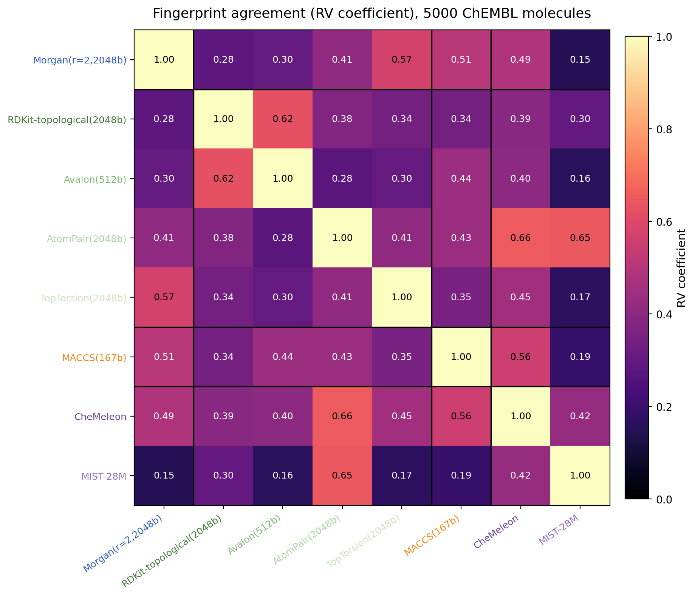
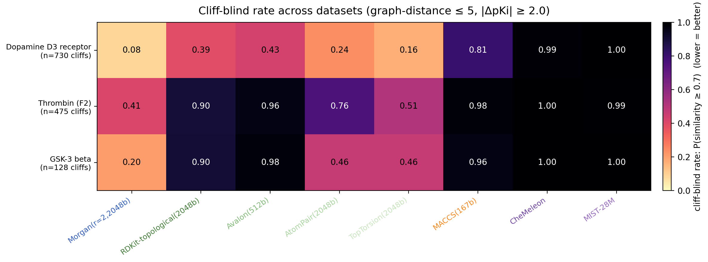
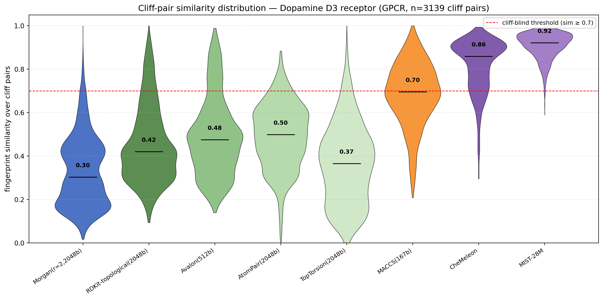
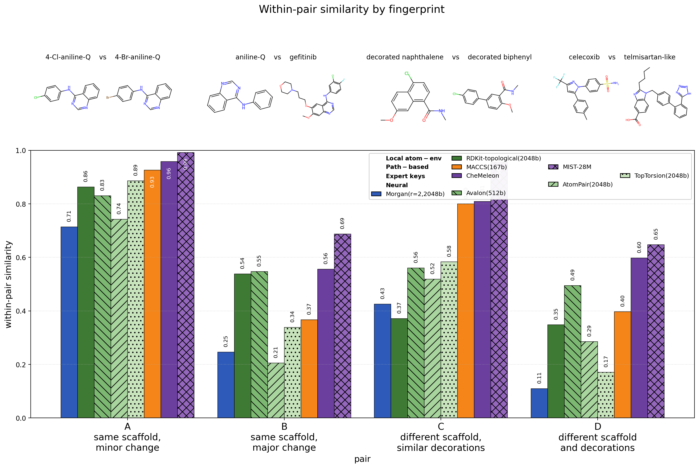
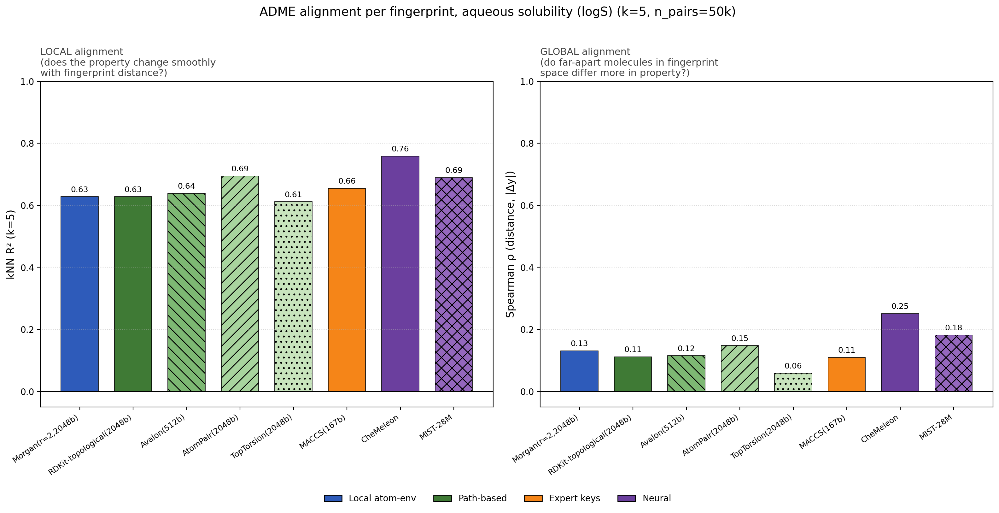
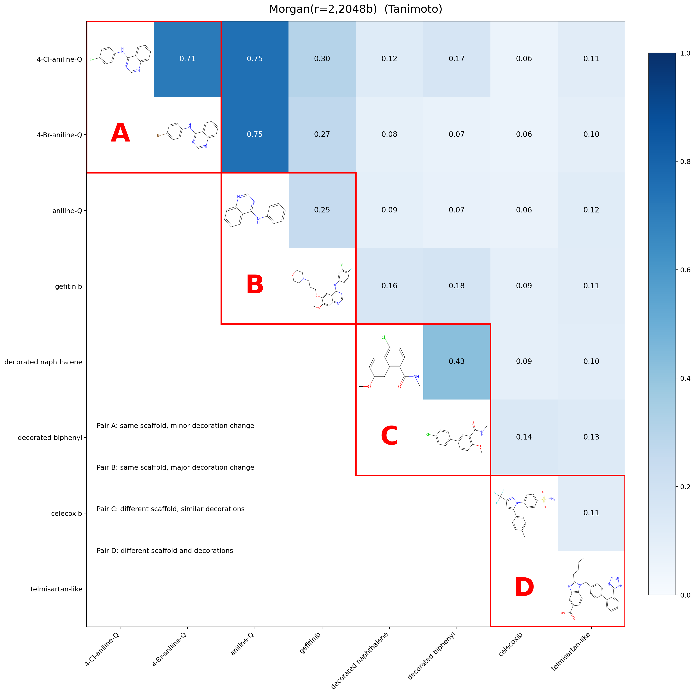

# Comparing classical and neural molecular fingerprints

Eight fingerprints (six classical RDKit + two neural) probed across six lenses. The point is not to crown a winner — it's to show how different the fingerprints actually are, and where each one's blind spots hide.

## Fingerprints studied

- **Local atom-environment**: Morgan (r=2, 2048 bits)
- **Path-based**: RDKit topological, Avalon, AtomPair, TopTorsion
- **Expert keys**: MACCS (167 bits)
- **Neural**: CheMeleon, MIST-28M

## Investigations

| # | Lens | Question |
|---|------|----------|
| 1 | Pair plots | What does each FP think of hand-picked molecule pairs? |
| 2 | ADME alignment | Does FP geometry track ADME properties? |
| 3 | Agreement matrix | How redundant are the FPs across each other? |
| 4 | Scaffold hopping | Does the FP preserve scaffold structure, and is that bought at the cost of property awareness? |
| 5 | Activity cliffs | For pre-defined activity cliffs (small chemical change, large potency change), what similarity score does each FP assign? |

There's also a clustering experiment under `figures/clustering/` (HDBSCAN over UMAP-reduced fingerprints on a 10k-molecule random ChEMBL sample). The result was that random ChEMBL is too scaffold-diverse to cluster meaningfully — useful as a sanity check that "fingerprint geometry → clusters" is not a free lunch, but not the central story.

## Conclusions

### Fingerprints encode genuinely different similarity geometries



The RV agreement matrix is the clearest evidence. Classical FPs are not redundant with each other — most pairs sit at RV 0.30–0.40. RDKit-topo and Avalon agree most (0.62, both path-based). MIST-28M is alone in its corner (RV ~0.15–0.30 with most others). CheMeleon bridges classical and MIST. AtomPair turns out to be the "connector" — high RV with both CheMeleon (0.66) and MIST (0.65) while still being related to the classical block.

### Both neural FPs are heavily cliff-blind

Activity cliffs are pairs of structurally-similar molecules with very different potency. We define them fingerprint-agnostically: graph_distance ≤ 5 (atoms not shared via the maximum common substructure with strict aromatic/non-aromatic bond matching) AND |ΔpKi| ≥ 2.0. Then for each cliff pair we ask each FP for its similarity score:



The hierarchy is consistent across all three ChEMBL targets:

- **Morgan, TopTorsion, AtomPair** correctly score most cliffs as low-similarity (cliff-blind rate ≤ 35% on the cleaner D3 cliff set; sub-50% on the harder Thrombin / GSK-3β sets).
- **MACCS, RDKit-topo, Avalon** sit in the middle — their similarity scales are coarser, so cliffs more often come out above 0.7.
- **CheMeleon and MIST-28M score nearly every cliff as similar** (cliff-blind rate 95–100%). Their similarity scales simply don't go low enough to discriminate cliff pairs from non-cliff pairs.

The D3 receptor violins make the scale issue stark:



Median cliff-pair similarity: Morgan 0.43, TopTorsion 0.49, Avalon 0.59, RDKit-topo 0.60, AtomPair 0.60, MACCS 0.77, **CheMeleon 0.90, MIST 0.95**. The neural FPs literally never score a cliff below ~0.7 on this dataset.

This is the most important caveat for using neural FPs in any retrieval-style workflow: **two molecules with cosine 0.9 in CheMeleon or MIST space can have 100× different potency**.

### What kinds of changes does each fingerprint actually see?

Per-fingerprint deep-dive figures are in [`figures/cliffs/`](figures/cliffs/) — one per FP showing its top-3 most cliff-blind and top-3 most cliff-aware molecule pairs across all three datasets, with non-MCS atoms highlighted. Reading those figures by eye:

- **Morgan**: shrugs at single-atom changes within a shared core (graph distance 1–2): one ring nitrogen swapped, a methyl shifted, a halogen swapped. It pulls similarity down once enough atom-environment bits change — typically when the substituent pattern around the scaffold reshuffles. Sensitive to: scaffold identity, halogen-vs-methyl swaps, substituent connectivity at radius 2. Insensitive to: changes confined to one or two atoms inside a polycyclic core.
- **TopTorsion**: similar profile to Morgan but with a tighter dynamic range — its "most cliff-aware" floor sits around 0.33–0.41 instead of Morgan's 0.11–0.33. Sensitive to: atom-quadruplet (4-atom path) changes that reshape long aliphatic chains. Insensitive to: localized atom swaps that preserve most 4-atom path patterns.
- **AtomPair**: gets fooled when changes preserve inter-atom path lengths (a heteroatom shift that keeps the same atom-pair distances will still register high). Sensitive to: changes that alter the distance between key atoms. Insensitive to: positional swaps at the same path distance.
- **RDKit-topo**: scores most cliffs near or above 0.7 even when the molecules look visibly different — its hashed-paths approach over-rewards shared connectivity. Limited dynamic range (Thrombin median 0.86). Sensitive to: scaffold replacement. Insensitive to: heteroatom swaps, substituent decoration, and even some ring-size changes.
- **Avalon**: similar shape to RDKit-topo but with a slightly broader range. Sensitive to: scaffold change, ring fusion changes. Insensitive to: small decorative changes.
- **MACCS**: routinely returns sim = 1.00 for cliff pairs because 167 bits is too coarse to distinguish many small-change pairs — they end up with identical bit vectors. Sensitive to: presence/absence of specific predefined substructures (carboxylic acid, halogens, particular ring systems). Insensitive to: anything that doesn't add or remove a key listed group.
- **CheMeleon**: cliff-aware floor is ~0.71 even on its best examples — it cannot score true cliffs as anything but "similar." Its similarity scale is calibrated for "same chemotype family." Sensitive to: scaffold-class changes. Insensitive to: any structural change short of a full scaffold rewrite.
- **MIST-28M**: the most compressed scale of all 8 — top-3 most cliff-aware on D3 are 0.71–0.75. Sensitive to: gross molecular character. Insensitive to: anything finer than that.

The pattern across the eight: **dynamic range correlates with cliff resolution**. Morgan's similarity distribution spans 0.0–1.0 over diverse pairs and gives it room to drop low on cliffs; MIST's distribution is squeezed into roughly 0.7–1.0 over the same molecule space, so it can't distinguish "structurally similar but functionally different" from "structurally similar and functionally similar."

### CheMeleon and MIST are different in other ways though

Lumping them as "the neural FPs" still misleads on every probe except cliffs:

- **CheMeleon dominates the scaffold-vs-property Pareto on AqSolDB** ([figure](figures/scaffolds/02_purity_vs_property_pareto_k5.png)) — both highest scaffold purity AND highest kNN R² on logS prediction. MIST sits in the middle of the pack.
- **MIST is the least scaffold-anchored** of all 8 FPs (scaffold purity 0.55 on AqSolDB vs 0.62–0.68 for everyone else, including CheMeleon).
- **MIST is the most isolated in the agreement matrix** (RV ~0.15–0.30 with most other FPs); CheMeleon sits closer to the classical block (RV 0.40–0.66).

Both are heavily cliff-blind, but only one (CheMeleon) is well-suited to ADME prediction. They reach the same problem from different directions: MIST's geometry is genuinely different from classical FPs (and that broad geometry can't resolve cliffs); CheMeleon's geometry is much more chemistry-aware but uses a similarity scale tuned for "this molecule is in the same chemotype family", not "this molecule has the same activity."

### Classical FPs are also not interchangeable

The pair plots already hinted at this — even on four hand-picked pairs the classical FPs disagree visibly:



- **Morgan** is the most idiosyncratic and the best at recognizing cliffs as different (median cliff similarity 0.43 on D3). Its highest off-diagonal in the RV matrix is only 0.57. Atom-environment hashing preserves both scaffold and decoration in a way path-based FPs don't.
- **Avalon** is the dark horse for non-cliff tasks. 512 bits, performs at the level of the 2048-bit FPs on scaffold purity (best on AqSolDB) and ADME prediction. But on cliffs its median similarity is high (0.59 on D3) — like the other path-based FPs, it has trouble distinguishing methyl-vs-OMe-style cliffs.
- **MACCS** is short (167 bits) and fast. The cliff-blind rate is the highest among the classical FPs (71%–97% across datasets) because 167 bits don't have the resolution to distinguish small-change cliffs.
- **RDKit-topo, AtomPair, TopTorsion** look similar on paper. They aren't (RV 0.28–0.62 with each other). On cliffs they vary widely: TopTorsion is the second-best after Morgan (median 0.49 on D3), AtomPair is in the middle (0.60), RDKit-topo the worst of the path-based set (0.60 median, 91% cliff-blind on Thrombin).

## Gotchas

**General:**

- **Don't bake one FP into how you define your test.** An earlier version of the cliff probe used "Morgan ≥ 0.9 with large Δy" or "kNN top-k" definitions; both reduced fingerprint comparison to "agreement with whichever FP we used to define the cliff set." The current cliff probe defines pairs from molecular graph properties only (graph_distance ≤ 5, |ΔpKi| ≥ 2.0).
- **Local geometry ≠ global geometry.** All FPs show useful local kNN signal but only modest global Spearman ρ — see the right panel below, ρ ≤ 0.25 everywhere on logS:

  

  Methods that rely on global geometry (UMAP-then-cluster, Spearman over all pairs) amplify whatever idiosyncrasy each FP has.
- **Scaffold-purity needs scaffold-repeat-rich data.** Random ChEMBL is so scaffold-diverse (4490 unique scaffolds per 5000 molecules) that purity-at-k is mostly noise. AqSolDB has dense repeats and is the right venue.

**Per-fingerprint:**

- **MACCS** has only 167 bits — distinct molecules collide more often, and small-change activity cliffs almost always come out high-similarity (cliff-blind rate 71–97%).
- **MIST cosine scores are NOT on the same scale as Tanimoto.** Cosine 0.4 between two MIST embeddings does not mean what 0.4 Tanimoto means. The cliff-pair probe makes this concrete: MIST median similarity over D3 cliff pairs is 0.95 (Morgan's is 0.43). Threshold-based intuition built on Morgan does not transfer. Use rank-based comparisons or per-FP-calibrated thresholds.
- **CheMeleon similarity is "chemistry-aware" but not biology-aware.** It scores activity cliffs at median similarity 0.90 on D3 — chemically the molecules in a cliff pair really are very similar, and CheMeleon agrees. It just doesn't know that small chemical change can imply huge potency change.
- **Morgan's "two molecules share a key motif" failure mode** is real: two compounds can both light up the same Morgan bit while differing globally. The drug-sized pair heatmap shows this — 0.75 Tanimoto between aniline-quinazoline and gefitinib, driven entirely by their shared core:

  

  Conversely, on properly-defined cliffs (small change → big activity change) Morgan is the best discriminator we tested — its bit-vector resolution captures small modifications well.

## Practical takeaway

Pick the fingerprint for the question:

- **Activity-cliff-sensitive retrieval** on a known target → Morgan or TopTorsion. Both keep cliff-blind rates ≤ 25% on most ChEMBL targets we tested. Avoid neural FPs and MACCS for this.
- **ADME prediction** (logS, logD, BBB) by kNN regression → CheMeleon dominates on logS and lipophilicity. The cliff blindness doesn't hurt as much when properties are smoothly distributed (no single methyl-swap is going to flip logS by 100×).
- **Chemotype discovery / clustering** in a drug-like library → if natural clusters exist at all, MACCS and Avalon are most likely to surface them; MIST is the least scaffold-anchored and least likely to.
- **Feature input to a supervised neural model** → MIST's distinctness from classical FPs may be the point. The downstream model can re-learn cliff structure from labels.
- **One general-purpose FP** → no single winner. Morgan handles cliffs and pair-level similarity well but is dominated by CheMeleon on ADME-property kNN. CheMeleon handles ADME but is heavily cliff-blind. Use Morgan for retrieval, CheMeleon for property prediction.
- **Ensembling** → pair Morgan with AtomPair (or with CheMeleon) for maximally distinct views. The agreement matrix shows AtomPair is the bridge between classical and neural FPs.

## Reproducing

```bash
uv sync
uv run python scripts/figure_pairs.py
uv run python scripts/figure_clustering.py
uv run python scripts/figure_adme.py
uv run python scripts/figure_adme_alignment.py --mode sweep
uv run python scripts/figure_adme_alignment.py --mode bars --k 5
uv run python scripts/figure_agreement.py
uv run python scripts/figure_scaffolds.py
uv run python scripts/figure_cliffs.py
```

Figures land under `figures/<topic>/`.
